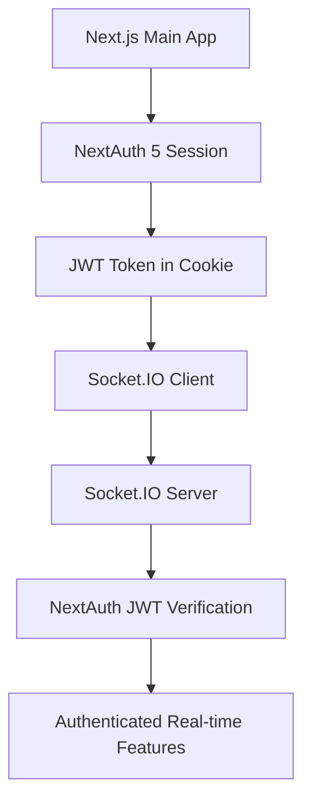

I'll verify how the main app and Socket.IO server connect and work together with NextAuth 5. Let me examine the current implementation and explain the flow. Now let me check how the client connects to the Socket.IO server: Now let me check how the client-side Socket.IO integration works: Perfect! Now I have a complete understanding of how the main app and Socket.IO server connect and work together with NextAuth 5. Let me explain the comprehensive flow and verify it's working correctly.

## 🔄 **Main App & Socket.IO Authentication Flow Explanation**

Based on my analysis, here's how your NextAuth 5 authentication system connects the main app with the Socket.IO server:

### **1. Authentication Architecture Overview**



### **2. Detailed Flow Breakdown**

#### **📱 Client-Side (Main App)**

1. **User Authentication**:
   - User signs in via NextAuth 5 (`/api/auth/signin`)
   - NextAuth creates JWT token stored in `next-auth.session-token` cookie
   - Session data available via `useSession()` hook

2. **Socket Connection Initialization**:
   ```tsx
   // From lib/socket/socket-context-clean.tsx
   const { data: session } = useSession()
   
   // Extract session token from cookies
   const sessionToken = await getSessionToken()
   
   // Create Socket.IO connection with official auth
   const socket = io(SOCKET_URL, {
     auth: {
       token: sessionToken,      // JWT token from NextAuth
       userId: session.user.id,
       email: session.user.email
     },
     withCredentials: true,      // Send cookies
     transports: ['websocket', 'polling']
   })
   ```

3. **Multi-Source Token Extraction**:
   - Primary: Cookie parsing (`next-auth.session-token`)
   - Fallback: API session endpoint
   - Secure variants: `__Secure-next-auth.session-token`

#### **🖥️ Server-Side (Socket.IO Server)**

1. **Authentication Middleware**:
   ```javascript
   // From socketio-standalone-server/middleware/auth.js
   io.use(async (socket, next) => {
     await authMiddleware.authenticateConnection(socket, next)
   })
   ```

2. **Token Extraction (Priority Order)**:
   ```javascript
   extractToken(socket) {
     // 1. From auth object (primary)
     socket.handshake.auth?.token
     
     // 2. From cookies (NextAuth standard)
     socket.handshake.headers.cookie // 'next-auth.session-token=...'
     
     // 3. From authorization header
     socket.handshake.headers.authorization // 'Bearer ...'
     
     // 4. From query parameters (fallback)
     socket.handshake.query?.token
   }
   ```

3. **Official NextAuth 5 JWT Verification**:
   ```javascript
   // Uses official NextAuth 5 decode method
   const decoded = await decode({
     token: token,
     secret: process.env.AUTH_SECRET,
     salt: 'authjs.session-token'  // Official NextAuth 5 salt
   })
   ```

4. **User Session Attachment**:
   ```javascript
   // Attach authenticated user to socket
   socket.user = {
     id: decoded.sub,
     email: decoded.email,
     name: decoded.name,
     username: decoded.username,
     isVerified: decoded.isVerified
   }
   socket.authenticated = true
   ```

### **3. Real-time Feature Integration**

Once authenticated, the Socket.IO server provides:

- **User Presence**: Online status tracking
- **Real-time Posts**: Live post updates and notifications
- **Voice Calls**: WebRTC signaling with authentication
- **Study Groups**: Real-time collaboration
- **Chat Messages**: Direct and group messaging
- **Live Notifications**: Push notifications

### **4. Key Configuration Files**

#### **Environment Variables** (Both Apps):
```bash
# NextAuth 5 Secret (MUST MATCH)
AUTH_SECRET=your-secret-key
NEXTAUTH_SECRET=your-secret-key  # Legacy compatibility

# Socket.IO Configuration
NEXT_PUBLIC_SOCKET_URL=http://localhost:3001
SOCKET_IO_CORS_ORIGIN=http://localhost:3000
```

#### **Split Configuration Pattern**:
- auth.config.ts: Edge-compatible base config (middleware)
- auth.ts: Full config with Prisma adapter (main app)
- auth.js: Server config matching main app

