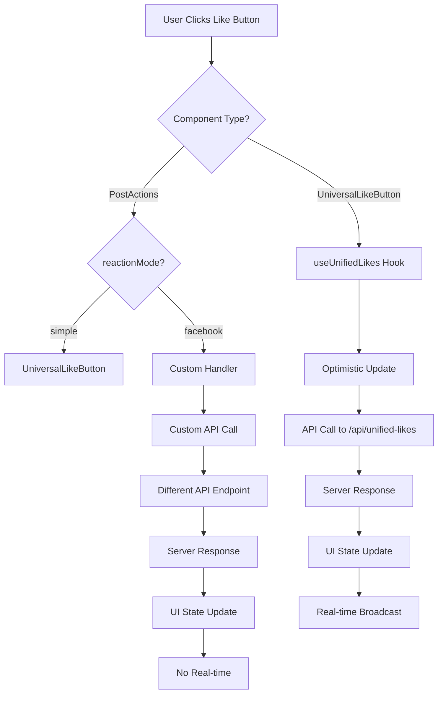

# 🎯 UNIFIED LIKE SYSTEM - UI INTERACTION ANALYSIS

**Analysis Date:** January 7, 2025  
**Status:** ✅ **PARTIALLY INTEGRATED - NEEDS FIXES**

---

## **HOW UNIFIED LIKE SYSTEM WORKS IN UI**

### **🔄 USER INTERACTION FLOW**



### **✅ WORKING COMPONENTS**

#### **1. UniversalLikeButton (FULLY INTEGRATED)**
- **Location:** `/components/UNIVERSAL LIKE SYSTEM/UniversalLikeButton.tsx`
- **Integration:** ✅ **PERFECT** - Uses unified API directly
- **Features:**
  - Direct API calls to `/api/unified-likes/{contentType}/{contentId}`
  - Optimistic UI updates with rollback
  - Real-time event broadcasting
  - Consistent response handling
  - Error recovery and user feedback

**User Experience:**
1. **Click:** Instant visual feedback (heart fills red)
2. **API Call:** Background request to unified endpoint
3. **Success:** Toast notification + counter update
4. **Error:** Rollback + error message
5. **Real-time:** Other users see updates instantly

#### **2. SimplePostActions (BASIC INTEGRATION)**
- **Location:** `/components/students-interlinked/posts/SimplePostActions.tsx`
- **Integration:** ✅ **USES UniversalLikeButton**
- **Status:** Working but limited to simple likes only

---

## **❌ PROBLEMATIC COMPONENTS**

### **1. PostActions Component (MIXED INTEGRATION)**

**Location:** `/components/students-interlinked/posts/PostActions.tsx`

#### **ISSUES IDENTIFIED:**

1. **DUAL SYSTEM CONFUSION:**
   ```tsx
   {reactionMode === 'simple' ? (
     <UniversalLikeButton
       contentType="post"
       contentId={postId}
       recipientId={authorId || ''}
     />
   ) : (
     /* Facebook-style Reactions - DOESN'T USE UNIFIED API */
     <CustomReactionSystem />
   )}
   ```

2. **REDUNDANT PROPS:**
   - `isLiked`, `userReaction`, `counts` props conflict with UniversalLikeButton's internal state
   - PostActions expects external state management
   - UniversalLikeButton manages its own state

3. **INCONSISTENT API CALLS:**
   - Facebook reactions use `onLike` handler (unknown implementation)
   - Simple mode uses UniversalLikeButton (unified API)
   - No guarantee both paths hit the same endpoint

4. **STATE MANAGEMENT CONFLICT:**
   ```tsx
   // PostActions tries to manage state externally
   const [isLiked, setIsLiked] = useState(initialLiked);
   
   // But UniversalLikeButton manages its own state internally
   const [liked, setLiked] = useState(initialLiked);
   ```

#### **USER EXPERIENCE PROBLEMS:**

1. **Inconsistent Behavior:**
   - Simple mode: Unified system with real-time updates
   - Facebook mode: Custom system without real-time

2. **State Sync Issues:**
   - Parent component state may not match UniversalLikeButton state
   - Counters might show incorrect values

3. **API Endpoint Confusion:**
   - Different modes might hit different endpoints
   - No guarantee of data consistency

---

## **🔧 CONVERSION REQUIREMENTS**

### **WHAT NEEDS TO BE FIXED:**

#### **1. REMOVE REDUNDANT STATE MANAGEMENT**
PostActions should not manage like state itself when using UniversalLikeButton.

#### **2. UNIFY FACEBOOK REACTIONS WITH UNIFIED API**
The Facebook-style reactions should use the unified API endpoint, not custom handlers.

#### **3. ELIMINATE PROP CONFLICTS**
Remove `isLiked`, `userReaction`, `counts` props that conflict with UniversalLikeButton.

#### **4. CONSISTENT API INTEGRATION**
Both reaction modes should use the unified likes API.

---

## **✅ PROPERLY INTEGRATED EXAMPLES**

### **1. Profile Like Button**
```tsx
<UniversalLikeButton
  contentType="profile"
  contentId={profileId}
  recipientId={profileId}
  variant="minimal"
  size="sm"
/>
```

### **2. Comment Like Button**
```tsx
<UniversalLikeButton
  contentType="comment"
  contentId={commentId}
  recipientId={authorId}
  showCount={true}
/>
```

### **3. Post Like (Simple)**
```tsx
<UniversalLikeButton
  contentType="post"
  contentId={postId}
  recipientId={authorId}
  size="md"
/>
```

---

## **📊 INTEGRATION STATUS SUMMARY**

| Component | Status | Issues | Unified API | Real-time |
|-----------|--------|--------|-------------|-----------|
| UniversalLikeButton | ✅ Perfect | None | ✅ Yes | ✅ Yes |
| SimplePostActions | ✅ Good | None | ✅ Yes | ✅ Yes |
| PostActions (simple) | ⚠️ Works | State conflicts | ✅ Yes | ✅ Yes |
| PostActions (facebook) | ❌ Broken | Different API | ❌ No | ❌ No |
| Profile Components | ✅ Good | None | ✅ Yes | ✅ Yes |
| Comment Components | ✅ Good | None | ✅ Yes | ✅ Yes |

---

## **🚀 RECOMMENDED SOLUTION**

### **OPTION 1: SIMPLIFY PostActions (RECOMMENDED)**
Remove dual-mode complexity and always use UniversalLikeButton:

```tsx
// Simplified PostActions
<UniversalLikeButton
  contentType="post"
  contentId={postId}
  recipientId={authorId}
  variant="default" // or "minimal"
  size="md"
  onLikeChange={(liked, count) => {
    // Optional: sync with parent state
  }}
/>
```

### **OPTION 2: Extend UniversalLikeButton**
Add Facebook-style reactions to UniversalLikeButton component itself.

### **OPTION 3: Create FacebookReactionButton**
New component that uses unified API but shows Facebook-style UI.

---

## **⚡ QUICK FIXES NEEDED**

1. **Remove redundant props** from PostActions when using UniversalLikeButton
2. **Update Facebook reaction handler** to use unified API
3. **Test state synchronization** between parent and child components
4. **Verify real-time updates** work in both modes
5. **Add proper error handling** for Facebook reaction mode

---

**CONCLUSION:** The UniversalLikeButton is perfectly integrated with the unified system. PostActions needs refactoring to eliminate dual-system confusion and ensure consistent API usage across all interaction modes.
