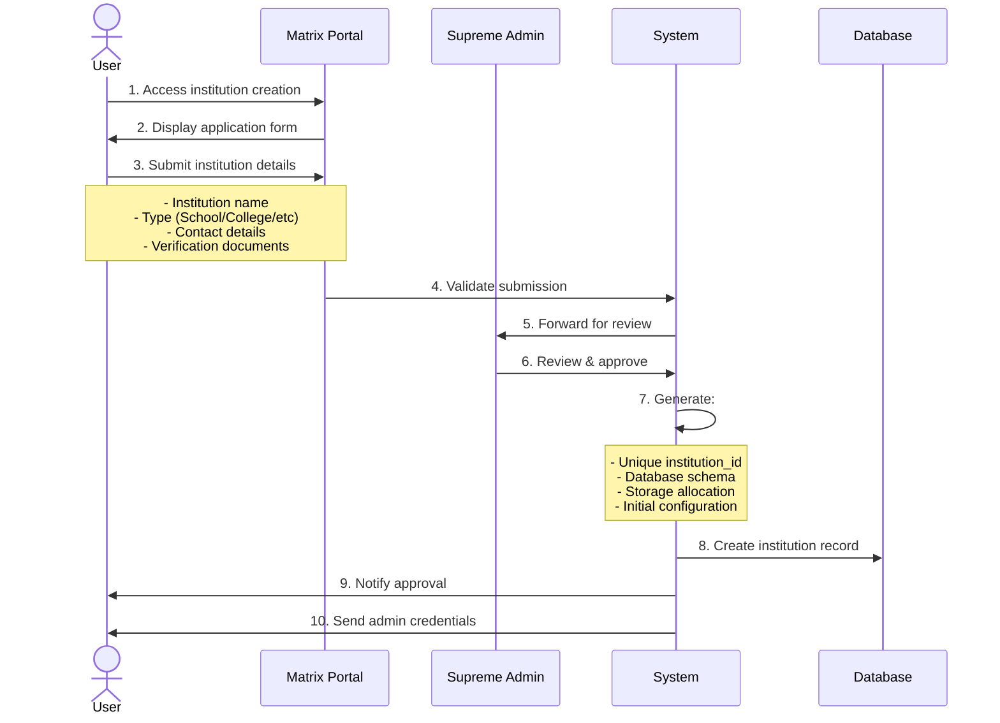
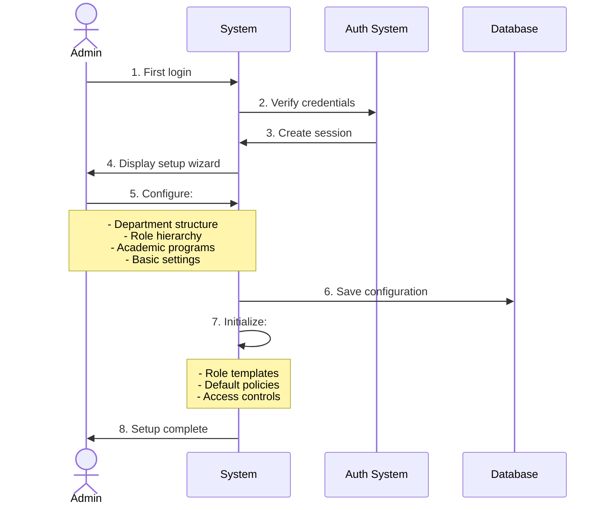
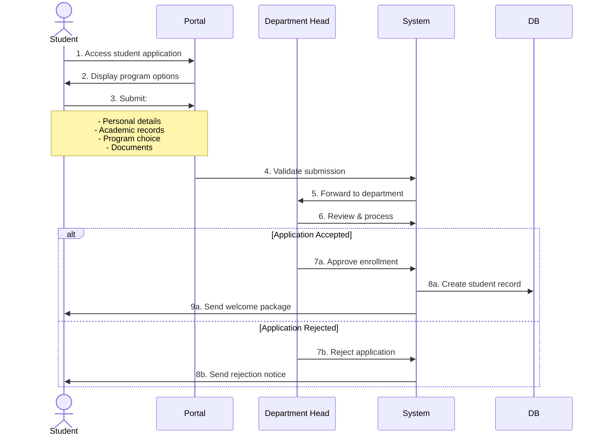
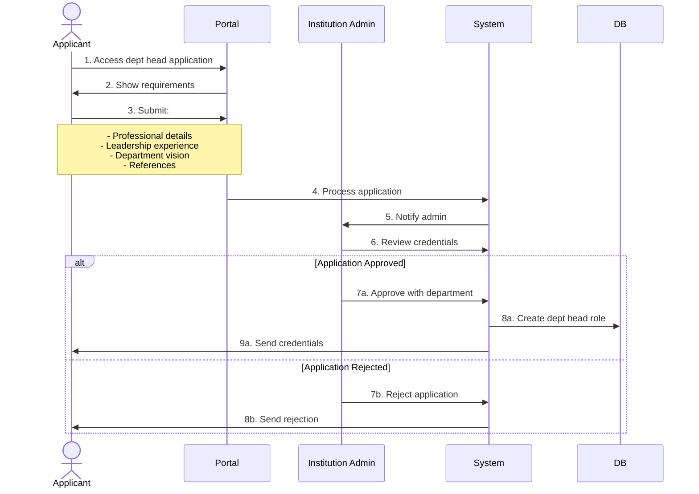
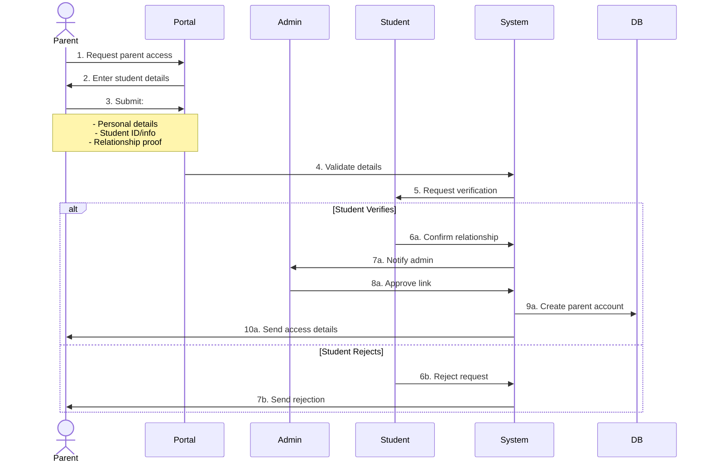
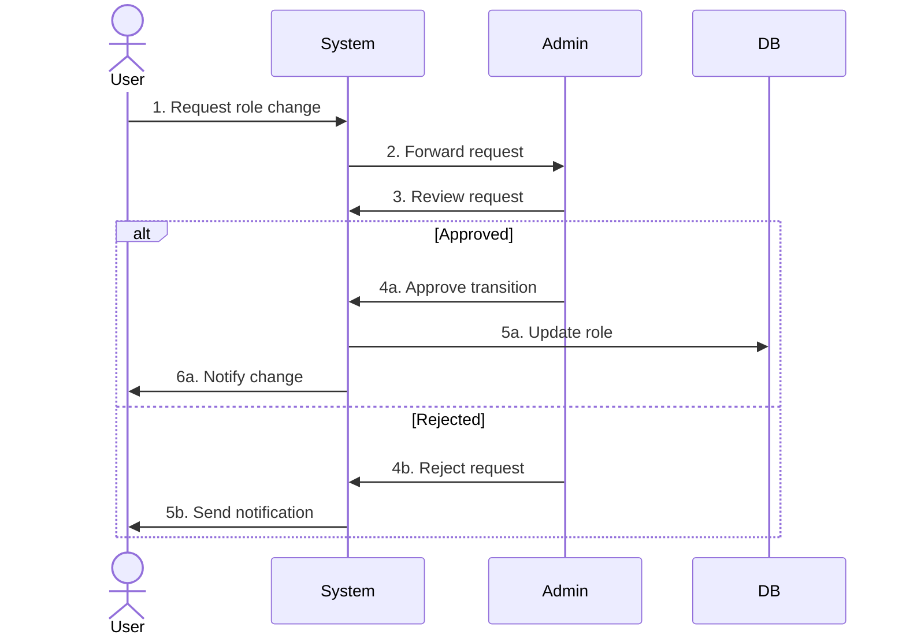
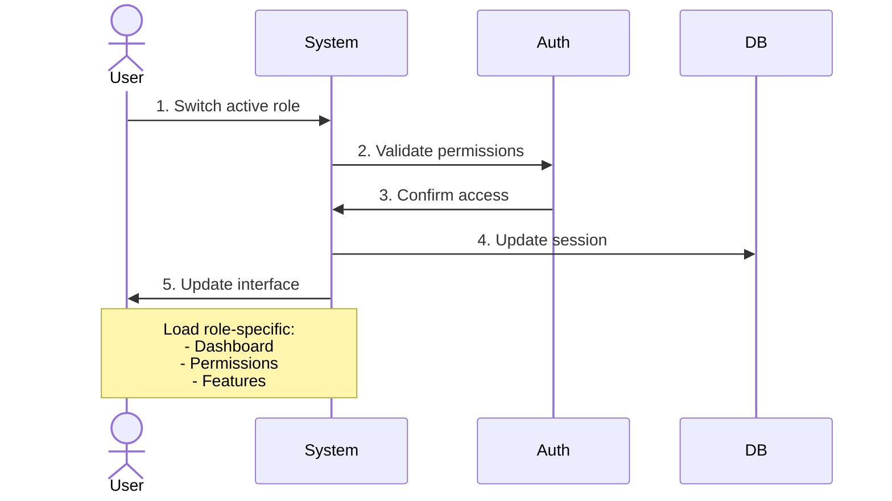

/**
 * @fileoverview Edu Matrix Hub Application Flow Documentation
 * WHY: Define comprehensive flow diagrams for all application processes
 * WHERE: Used as reference for implementing application flows
 * HOW: Documents step-by-step flows with sequence diagrams
 */

# Edu Matrix Hub Application Flows

## 1. Institution Creation Flow

### A. Application Process

### B. Post-Approval Setup

## 2. Role-Based Application Flows

### A. Teacher Application Flow

### B. Student Application Flow

### C. Department Head Application Flow

### D. Parent Account Creation Flow

## 3. Account Management Flows

### A. Role Transition Flow

### B. Multi-Role Management

## 4. Usage Guidelines

### A. Institution Creation
1. Pre-requisites:
   - Valid platform account
   - Required documentation
   - Institution details prepared

2. Process Timeline:
   - Application: 15-30 minutes
   - Review: 1-2 business days
   - Setup: 30-60 minutes

3. Best Practices:
   - Complete all fields accurately
   - Provide clear documentation
   - Follow setup wizard completely

### B. Role Applications
1. Documentation Requirements:
   - Teacher: Qualifications, experience, certifications
   - Student: Academic records, ID proof
   - Department Head: Professional experience, references
   - Parent: Relationship proof, student details

2. Processing Times:
   - Teacher: 2-3 business days
   - Student: 1-2 business days
   - Department Head: 3-5 business days
   - Parent: 1-2 business days

3. Verification Steps:
   - Document authenticity check
   - Reference verification
   - Student confirmation (for parents)
   - Admin approval

## 5. Security Considerations

### A. Application Security
1. Document Verification:
   - Digital signature validation
   - Document expiry check
   - Authenticity verification

2. Identity Verification:
   - Email verification
   - Phone verification
   - Document cross-check

3. Access Control:
   - Role-based permissions
   - Institution isolation
   - Session management

### B. Data Protection
1. Document Storage:
   - Encrypted storage
   - Access logging
   - Retention policies

2. Personal Information:
   - Data minimization
   - Purpose limitation
   - Access controls

3. Audit Trail:
   - Application tracking
   - Approval logging
   - Access monitoring