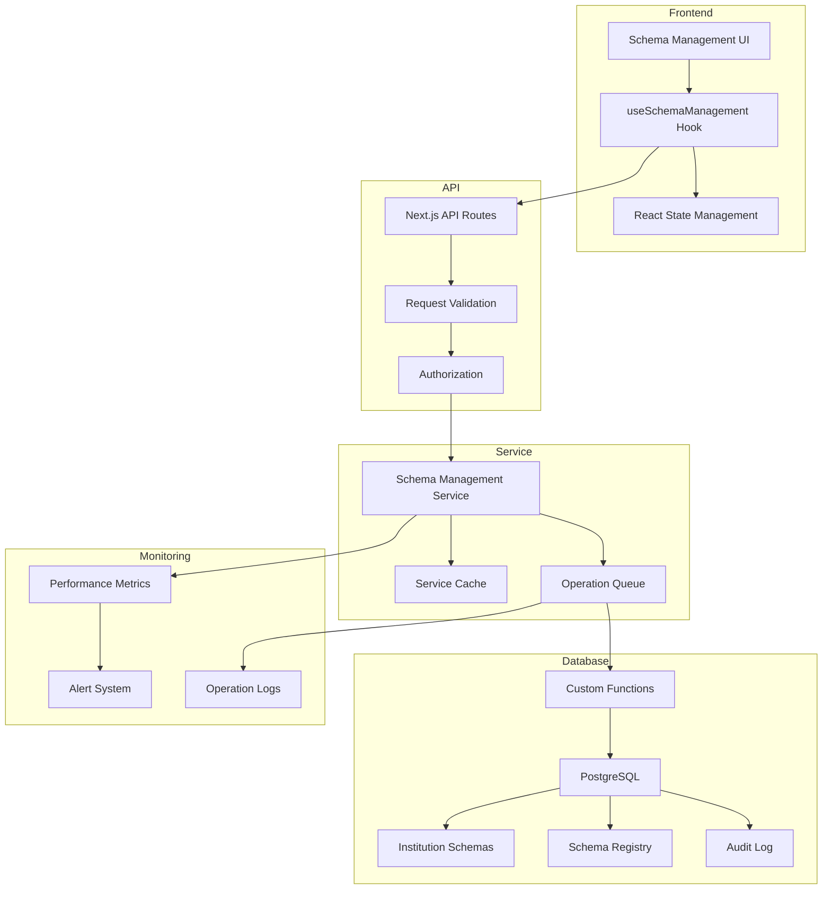
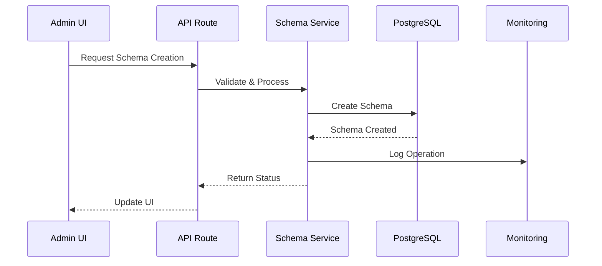
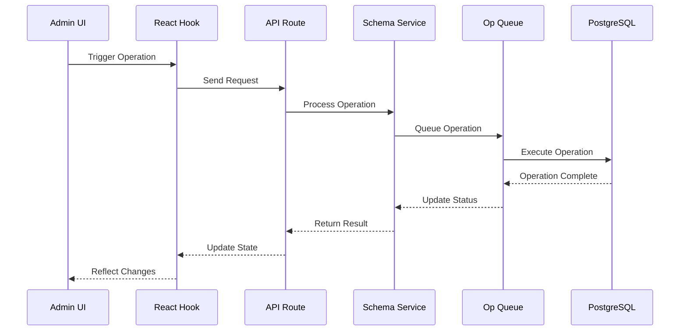
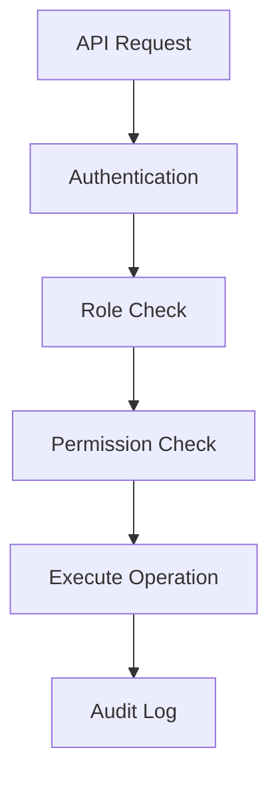
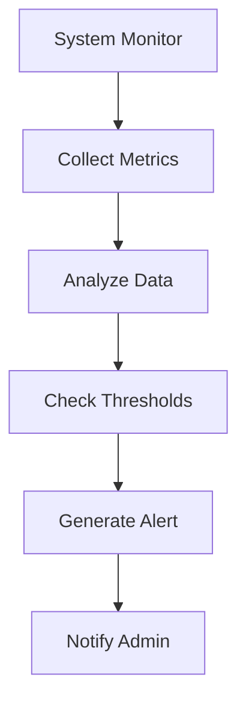
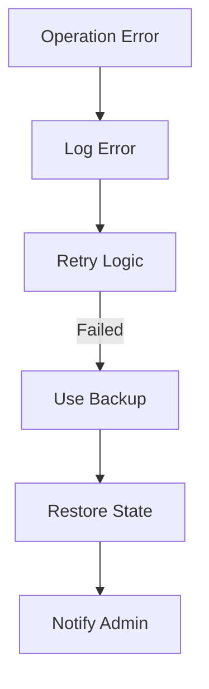
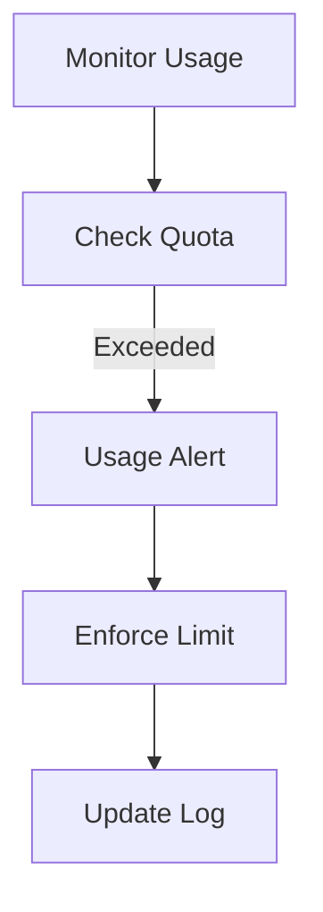
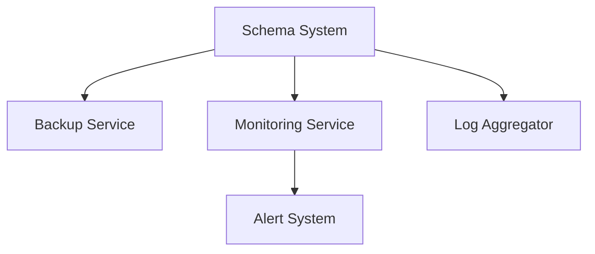

# Schema Management System Architecture

## Component Details

### Frontend Layer
- **Schema Management UI**: React component for administrative control
- **useSchemaManagement Hook**: Custom hook for schema operations
- **React State Management**: Local state handling with optimistic updates

### API Layer
- **Next.js API Routes**: RESTful endpoints for schema operations
- **Request Validation**: Input validation and sanitization
- **Authorization**: Role-based access control

### Service Layer
- **Schema Management Service**: Core business logic implementation
- **Service Cache**: Performance optimization layer
- **Operation Queue**: Async operation management

### Database Layer
- **PostgreSQL**: Main database engine
- **Custom Functions**: Specialized schema operations
- **Institution Schemas**: Tenant-specific schemas
- **Schema Registry**: Central schema tracking
- **Audit Log**: Operation history

### Monitoring Layer
- **Performance Metrics**: Operation timing and resource usage
- **Alert System**: Proactive issue notification
- **Operation Logs**: Detailed operation tracking

## Data Flow

### Schema Creation Flow

### Schema Operation Flow

## Security Architecture

### Access Control Flow

## Monitoring Architecture

### Alert Flow

## Error Handling

### Recovery Flow

## Resource Management

### Quota Management

## Integration Points

### External Systems

This architecture provides:
- Clear component separation
- Defined data flows
- Security integration
- Monitoring capabilities
- Error handling procedures
- Resource management
- Integration flexibility