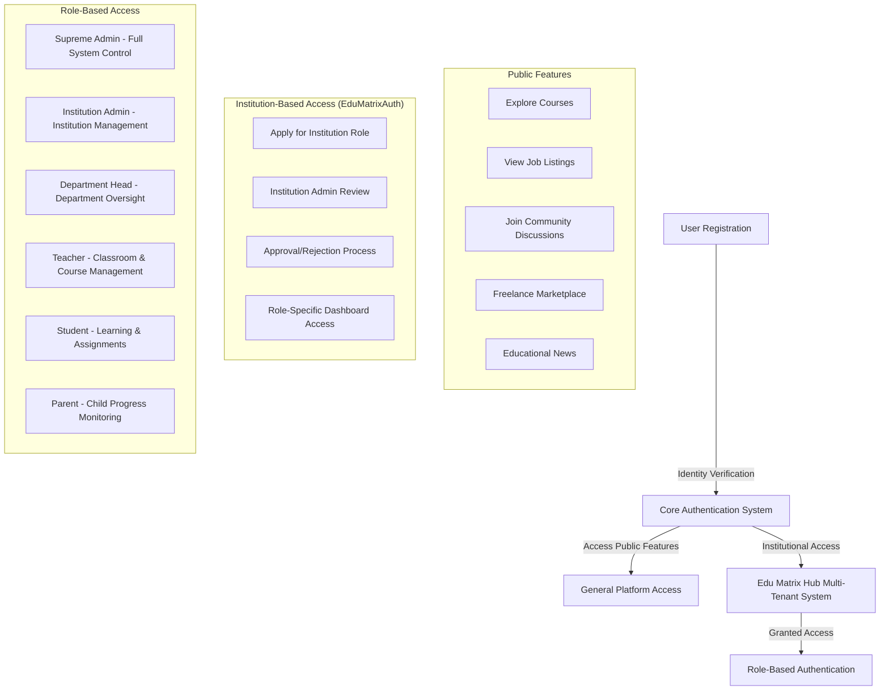
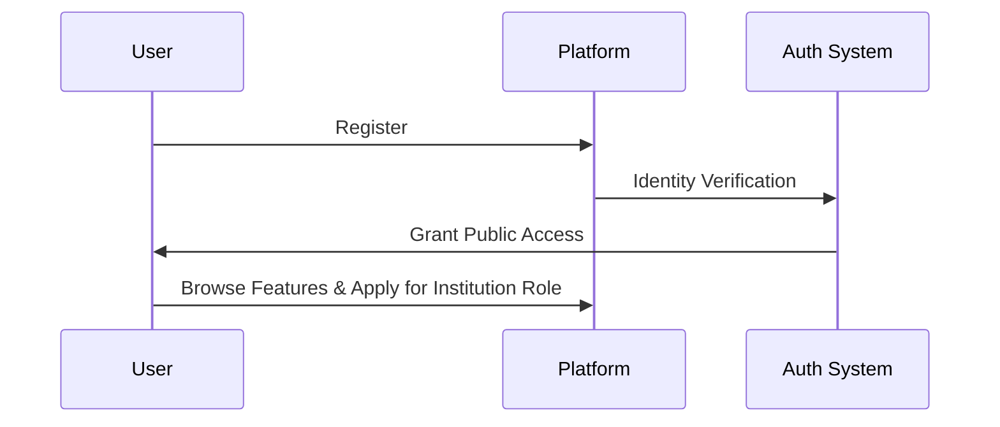
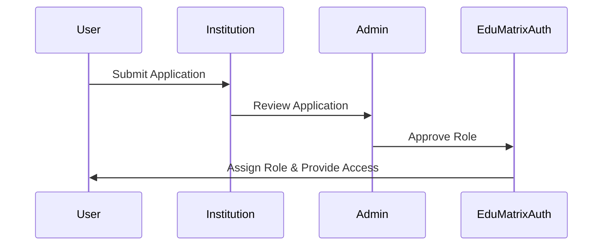
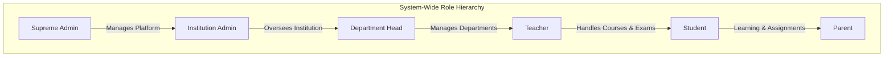
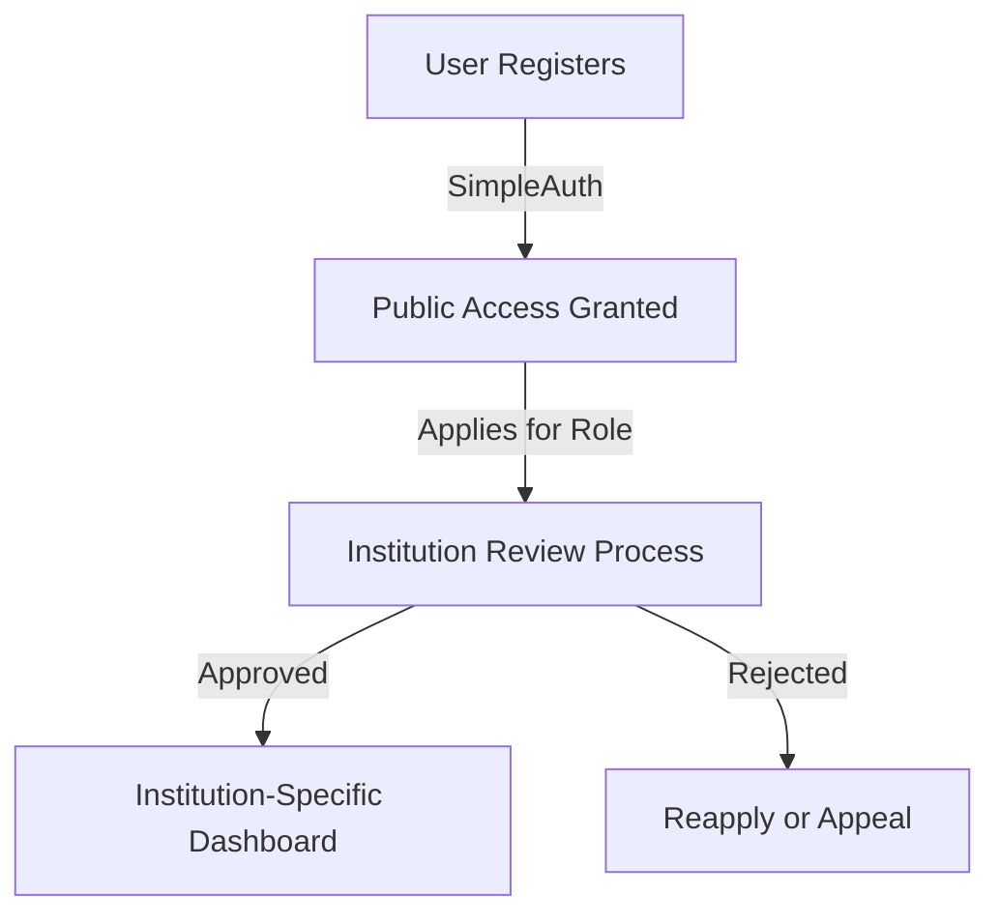
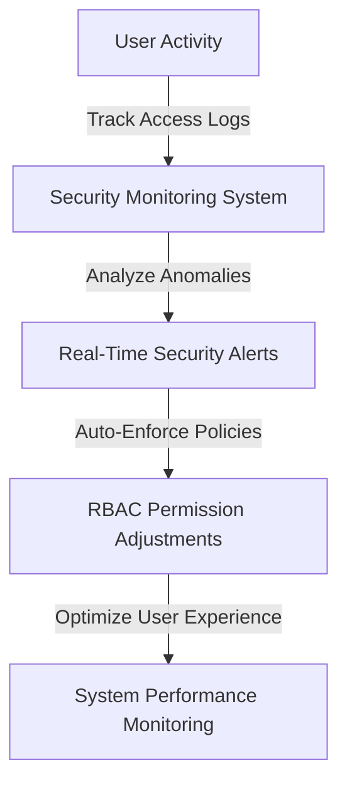

# EDU Matrix Interlinked - Authentication Map
# TWO AUTHENTICATION SYSTEMS  
## 1. SimpleAuth - General Platform Access
## 2. EduMatrixAuth - Institution-Based Access

# Advanced Authentication System for Edu Matrix Hub

## 1. System Architecture Overview


EDU Matrix Interlinked - Authentication Map

Overview

The EDU Matrix Interlinked Authentication System is a multi-layered authentication architecture designed to support millions of users across multiple institutions, ensuring data security, seamless access, and role-based controls. The system is divided into two primary authentication mechanisms:

1. SimpleAuth - General Platform Access

Allows users to register and access basic platform features.

Enables users to explore public student interlinked, explore educational institutions (schools, colleges, universities etc and apply), courses, job listings, freelance marketplaces, and community discussions.

Provides email-based authentication, password hashing, and session management.

## 2. EduMatrixAuth - Institution-Based Access

Required for institutional roles such as Admin, Department Head, Teacher, Student, and Parent.

Implements multi-factor authentication (MFA), role-based access control (RBAC), and tenant-specific data isolation.

Ensures granular access permissions based on institution-specific policies.

### Authentication Methods
- **Username & Password**: Standard login method with secure hashing.
- **Multi-Factor Authentication**: Additional verification via SMS or email.




## 2. Authentication & Access Flow

### A. General Authentication Flow


### B. Institution-Specific Authentication (EduMatrixAuth)


## 3. Multi-Tenant Role-Based Access Control (RBAC)



### Role-Specific Responsibilities
| Role | Responsibilities |
|----------------|----------------|
| **Supreme Admin** | Complete system control, institution approvals, security enforcement |
| **Institution Admin** | Manages institution settings, staff, students, financials |
| **Department Head** | Oversees department operations, teacher assignments, analytics |
| **Teacher** | Conducts classes, manages students, grades assignments |
| **Student** | Accesses learning resources, submits work, takes exams |
| **Parent** | Monitors child progress, communicates with teachers |

## 4. Data Isolation & Security Enforcement

### Multi-Tenant Data Management Strategy
```mermaid
graph TD
    A[Institution] -->|Tenant Isolation via Institution ID| B[Dedicated Data Storage]
    B -->|Enforced by| C[Row-Level Security (RLS)]
    B -->|Access Controlled by| D[Role-Based Permissions (RBAC)]
    B -->|Monitored by| E[Audit Logging & Security Alerts]
```

### Security Architecture
- **Public Access Security**: Email verification, strong password policies, device-based authentication
- **Institutional Security**: Multi-factor authentication (MFA), encrypted data storage, access control lists (ACLs)
- **Enterprise-Level Protection**: Real-time audit logs, AI-driven anomaly detection, institution-level firewall enforcement

## 5. Authentication Lifecycle & Access Management

### A. User Access & Transition Flow


### B. System Monitoring & Compliance Enforcement


### Continuous System Enhancements
1. **Adaptive Access Control**: adjustment for dynamic permissions
2. **Scalability Optimization**: Ensuring seamless authentication for millions of users

/**
 * @fileoverview Authentication Schema Documentation 
 * WHAT: Define database schema for auth system
 * WHERE: Used across EDU Matrix Interlinked platform
 * HOW: Prisma schema implementation
 */

# Authentication Schema Map

## 1. Core Schema Structure

### A. User Authentication
```prisma
model User {
  id            String    @id @default(cuid())
  email         String    @unique
  passwordHash  String
  role          Role      @default(STUDENT)
  tenantId      String?   // For Edu Matrix Hub users
  createdAt     DateTime  @default(now())
  updatedAt     DateTime  @updatedAt

  // Relations
  profile       Profile?
  institution   Institution? @relation(fields: [tenantId], references: [id])
  sessions      Session[]
}

