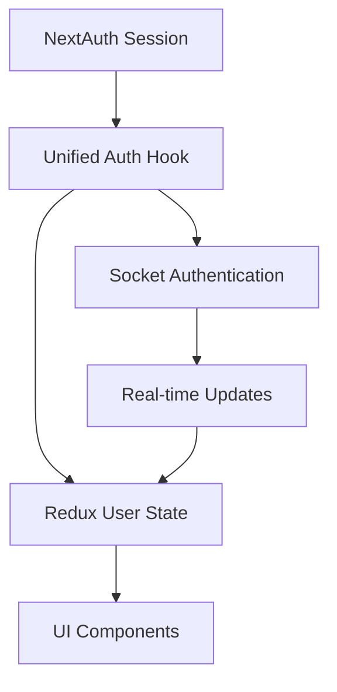

# 🔍 Frontend Conflicts Analysis: Redux Toolkit + NextAuth + Socket.IO

## 📋 **SUMMARY**
Analysis of conflicts, issues, and mistakes between Redux Toolkit, NextAuth, and Socket.IO in the frontend.

## 🚨 **CRITICAL ISSUES IDENTIFIED**

### **1. Authentication State Duplication**
- **Problem**: Multiple sources of truth for user authentication
- **Location**: `socket-context.tsx`, `use-auth.ts`
- **Impact**: State inconsistencies, race conditions
- **Severity**: HIGH

### **2. Socket Authentication Lifecycle Issues**
- **Problem**: Socket auth tokens become stale on session updates
- **Location**: `socket-client.ts`
- **Impact**: Authentication failures, connection drops
- **Severity**: HIGH

### **3. Redux Persist Hydration Conflicts**
- **Problem**: SSR/CSR mismatches with persisted realtime state
- **Location**: `store/index.ts`, `redux-provider.tsx`
- **Impact**: UI inconsistencies, hydration errors
- **Severity**: MEDIUM

### **4. Provider Order Dependencies**
- **Problem**: Socket provider depends on both Auth and Redux but initialization order matters
- **Location**: `layout.tsx`
- **Impact**: Undefined behavior during app initialization
- **Severity**: MEDIUM

### **5. Race Conditions on App Startup**
- **Problem**: Socket connects before Redux store is fully hydrated
- **Location**: `socket-context.tsx`
- **Impact**: Failed socket events, missing state updates
- **Severity**: MEDIUM

## 🔧 **DETAILED ANALYSIS**

### **Authentication State Management**

#### Current Implementation Issues:
```typescript
// ❌ Multiple auth states
const { data: session } = useSession()           // NextAuth
const userState = useSelector(state => state.user) // Redux (if exists)

// ❌ Socket uses session directly without Redux sync
socket.on('connect', () => {
  // Session data used but not synced to Redux
})
```

#### Recommended Solution:
```typescript
// ✅ Single source of truth pattern
const useAuthState = () => {
  const { data: session, status } = useSession()
  const dispatch = useDispatch()
  
  useEffect(() => {
    if (session?.user) {
      dispatch(setCurrentUser(session.user))
    }
  }, [session, dispatch])
  
  return { session, status }
}
```

### **Socket Authentication Lifecycle**

#### Current Issues:
```typescript
// ❌ Socket auth doesn't refresh on session updates
auth: {
  token: session?.accessToken, // Stale token issue
  userId: session?.user?.id
}
```

#### Recommended Solution:
```typescript
// ✅ Dynamic auth refresh
useEffect(() => {
  if (socket && session) {
    socket.auth = {
      token: session.accessToken,
      userId: session.user?.id
    }
    socket.connect()
  }
}, [session]) // Re-auth on session changes
```

### **Redux State Synchronization**

#### Current Issues:
```typescript
// ❌ Socket events update Redux without auth context
socket.on('message:new', (message) => {
  dispatch(addMessage(message)) // No auth validation
})
```

#### Recommended Solution:
```typescript
// ✅ Auth-aware Redux updates
socket.on('message:new', (message) => {
  if (session?.user?.id) {
    dispatch(addMessage({
      ...message,
      currentUserId: session.user.id
    }))
  }
})
```

## 🛠️ **IMPLEMENTATION FIXES**

### **1. Create Unified Auth State Hook**
```typescript
// hooks/use-unified-auth.ts
export const useUnifiedAuth = () => {
  const { data: session, status } = useSession()
  const dispatch = useDispatch()
  const currentUser = useSelector(selectCurrentUser)
  
  // Sync session to Redux
  useEffect(() => {
    if (session?.user && !currentUser) {
      dispatch(setCurrentUser(session.user))
    }
  }, [session, currentUser, dispatch])
  
  return {
    session,
    status,
    user: currentUser || session?.user,
    isAuthenticated: status === 'authenticated'
  }
}
```

### **2. Fix Socket Auth Lifecycle**
```typescript
// lib/socket/auth-socket-client.ts
export class AuthenticatedSocketClient extends SocketClient {
  private session: Session | null = null
  
  updateSession(newSession: Session | null) {
    this.session = newSession
    if (this.socket && newSession) {
      this.socket.auth = this.getAuthConfig(newSession)
      this.socket.connect()
    }
  }
  
  private getAuthConfig(session: Session) {
    return {
      token: session.accessToken,
      userId: session.user?.id,
      email: session.user?.email
    }
  }
}
```

### **3. Add Redux-Auth Sync Middleware**
```typescript
// lib/store/auth-sync-middleware.ts
export const authSyncMiddleware: Middleware = (store) => (next) => (action) => {
  const result = next(action)
  
  // Sync auth changes to socket
  if (action.type === 'auth/setCurrentUser') {
    const socketClient = getSocketClient()
    socketClient?.updateAuth(action.payload)
  }
  
  return result
}
```

### **4. Fix Provider Order and Dependencies**
```typescript
// components/providers/unified-provider.tsx
export function UnifiedProvider({ children }: { children: ReactNode }) {
  return (
    <AuthProvider>
      <ReduxProvider>
        <AuthSyncProvider>
          <SocketProvider>
            {children}
          </SocketProvider>
        </AuthSyncProvider>
      </ReduxProvider>
    </AuthProvider>
  )
}
```

## 🧪 **TESTING SCENARIOS**

### **Critical Test Cases:**
1. **Session Expiry**: Verify socket reconnects with new token
2. **Page Refresh**: Ensure Redux rehydration doesn't conflict with fresh session
3. **Multiple Tabs**: Test socket connection sharing and auth sync
4. **Network Disconnect**: Verify proper reconnection with current auth state

## 📊 **PERFORMANCE IMPACT**

### **Current Issues:**
- Multiple auth checks on every render
- Redundant socket connections
- Unnecessary Redux dispatches

### **Optimizations:**
- Memoized auth selectors
- Debounced socket reconnections
- Batched Redux updates

## 🔮 **RECOMMENDED ARCHITECTURE**



## ✅ **ACTION ITEMS**

1. **HIGH PRIORITY**:
   - [ ] Implement unified auth state management
   - [ ] Fix socket authentication lifecycle
   - [ ] Add session-socket sync mechanism

2. **MEDIUM PRIORITY**:
   - [ ] Add Redux persist exclude patterns for auth state
   - [ ] Implement auth-aware socket event handlers
   - [ ] Add comprehensive error boundaries

3. **LOW PRIORITY**:
   - [ ] Optimize re-render patterns
   - [ ] Add performance monitoring
   - [ ] Create debugging tools

## 📝 **NOTES**
- All fixes should maintain backward compatibility
- Gradual migration recommended for production systems
- Monitor performance impact during implementation
