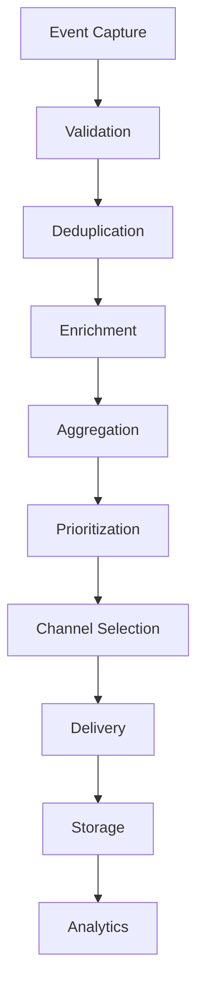

## Real-Time Notification Handler

```typescript
interface NotificationProcessor {
  // Kafka Topics
  topics: {
    jobs: "notifications.jobs";
    freelance: "notifications.freelance";
    social: "notifications.social";
    interactions: "notifications.interactions";
  };

  // Redis Cache Keys
  cacheKeys: {
    userNotifications: "user:{userId}:notifications";
    unreadCount: "user:{userId}:unread";
    preferences: "user:{userId}:preferences";
  };

  // Notification Queue Processing
  queueHandlers: {
    jobNotifications: {
      processNewJob: (jobData: JobPost) => {
        // Find matching users based on skills and preferences
        const matchedUsers = findMatchingUsers(jobData.requirements);
        
        // Create personalized notifications with match scores
        const notifications = matchedUsers.map(user => ({
          userId: user.id,
          type: "job",
          matchScore: calculateJobMatch(user, jobData),
          content: createJobNotification(jobData, user.preferences)
        }));

        // Queue notifications for delivery
        return queueNotifications(notifications);
      };

      processJobUpdate: (jobUpdate: JobUpdate) => {
        // Notify users who saved or applied to the job
        const interestedUsers = findInterestedUsers(jobUpdate.jobId);
        
        return queueUpdateNotifications(interestedUsers, jobUpdate);
      };
    };

    freelanceNotifications: {
      processNewProject: (projectData: Project) => {
        // Find relevant freelancers based on skills and availability
        const matchedFreelancers = findMatchingFreelancers(projectData);
        
        return queueProjectNotifications(matchedFreelancers, projectData);
      };
    };

    socialNotifications: {
      processInteraction: (interaction: SocialInteraction) => {
        // Group similar interactions
        const groupedNotification = groupSimilarInteractions(interaction);
        
        // Deliver based on user's preference
        return deliverSocialNotification(groupedNotification);
      };
    };
  };
}

// Notification Delivery System
interface NotificationDelivery {
  methods: {
    instant: {
      websocket: "Push to active users";
      badge: "Update unread count";
    };
    
    batched: {
      similar: "Group similar notifications";
      digest: "Combine low priority updates";
    };
  };

  prioritization: {
    highPriority: [
      "job_match_above_90",
      "project_exact_match",
      "social_mention",
      "direct_interaction"
    ];
    
    normalPriority: [
      "general_job_update",
      "similar_project",
      "social_like",
      "profile_view"
    ];
  };
}
```

Generated by Copilot

## Notification Processor Updates
- Detailed processing logic for batching and prioritizing notifications.
- Added error handling and retry workflows.

# Notification Processing System

## 1. Event Capture Layer

### Kafka Event Listeners
```typescript
interface EventListener {
  topics: {
    social: "social_events",
    academic: "academic_events",
    career: "career_events",
    community: "community_events",
    system: "system_events"
  };
  
  consumerGroups: {
    notifications: "notification_processors",
    analytics: "notification_analytics"
  };
  
  retention: "72 hours"; // 3 days for event replay
  partitioning: "user_id"; // Partition by user for ordered delivery
}
```

## 2. Processing Pipeline

### Event Aggregator
```typescript
interface EventAggregator {
  batchWindow: "5 minutes",
  maxBatchSize: 100,
  
  groupingRules: {
    likes: {
      window: "1 hour",
      threshold: 3,
      template: "grouped_likes"
    },
    comments: {
      window: "2 hours",
      threshold: 2,
      template: "grouped_comments"
    }
  }
}
```

### Notification Builder
```typescript
interface NotificationBuilder {
  enrichment: {
    userContext: true,
    devicePreferences: true,
    activityHistory: true
  },
  
  prioritization: {
    factors: {
      type: "weight: 0.3",
      userEngagement: "weight: 0.3",
      timeOfDay: "weight: 0.2",
      contentRelevance: "weight: 0.2"
    },
    thresholds: {
      urgent: 0.8,
      high: 0.6,
      normal: 0.0
    }
  }
}
```

## 3. Delivery System

### Channel Manager
```typescript
interface ChannelManager {
  channels: {
    webSocket: {
      queueSize: 1000,
      timeout: "5s",
      retryStrategy: "exponential"
    },
    push: {
      batchSize: 50,
      cooldown: "1m",
      providers: ["FCM", "APNS"]
    },
    email: {
      batchSize: 100,
      frequency: "15m",
      templates: "notification_email_templates"
    }
  }
}
```

### Delivery Rules
```typescript
interface DeliveryRules {
  quietHours: {
    check: true,
    defaultStart: "22:00",
    defaultEnd: "07:00",
    overrideForUrgent: true
  },
  
  rateLimiting: {
    perUser: "100/hour",
    perApp: "10000/minute",
    perChannel: {
      push: "20/hour",
      email: "5/hour",
      inApp: "50/hour"
    }
  }
}
```

## 4. Storage Strategy

### Redis Caching
```typescript
interface NotificationCache {
  recent: {
    key: "user:{userId}:notifications",
    maxItems: 100,
    ttl: "7d"
  },
  
  unread: {
    key: "user:{userId}:unread",
    maxItems: 50,
    ttl: "30d"
  },
  
  counters: {
    key: "user:{userId}:counts",
    fields: ["total", "unread", "urgent"],
    ttl: "90d"
  }
}
```

### PostgreSQL Storage
```typescript
interface NotificationStorage {
  tables: {
    notifications: {
      partitioning: "user_id",
      retention: {
        active: "90d",
        archived: "1y"
      }
    },
    notification_events: {
      partitioning: "created_at",
      retention: "30d"
    }
  },
  
  indexes: {
    primary: ["user_id", "created_at"],
    status: ["user_id", "is_read", "created_at"],
    type: ["user_id", "type", "created_at"]
  }
}
```

## 5. Error Handling

### Retry Strategies
```typescript
interface RetryStrategy {
  delivery: {
    maxAttempts: 3,
    backoff: "exponential",
    intervals: [1, 5, 15], // minutes
    deadLetter: true
  },
  
  processing: {
    maxAttempts: 5,
    backoff: "linear",
    interval: "30s",
    deadLetter: true
  }
}
```

## 6. Monitoring & Analytics

### Real-time Metrics
```typescript
interface NotificationMetrics {
  counters: {
    processed: "Counter",
    delivered: "Counter",
    failed: "Counter",
    interacted: "Counter"
  },
  
  gauges: {
    processingLag: "Gauge",
    queueSize: "Gauge",
    deliveryLatency: "Gauge"
  },
  
  histograms: {
    processingTime: "Histogram",
    deliveryTime: "Histogram",
    batchSize: "Histogram"
  }
}
```

## 7. Processing Flow

### Main Processing Pipeline


## 8. Implementation Guidelines

### 1. Event Processing:
- Use Kafka for reliable event streaming
- Implement exactly-once delivery semantics
- Maintain event ordering per user

### 2. Performance Optimization:
- Batch similar notifications
- Use caching for frequent data
- Implement smart throttling
- Use async processing where possible

### 3. Scalability Considerations:
- Horizontally scale processors
- Partition data by user_id
- Use Redis cluster for caching
- Implement proper back-pressure

### 4. Security Measures:
- Validate all events
- Encrypt sensitive data
- Implement rate limiting
- Add audit logging

### 5. Monitoring Setup:
- Track processing metrics
- Monitor queue depths
- Alert on delivery failures
- Measure user engagement